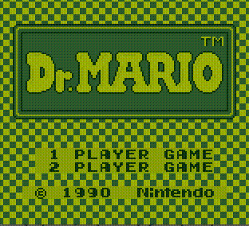

# MyLab2 GB
MyLab2 GB is a Gameboy emulator written in C for the MyLab2 card. The MyLab2 card is an expansion card developped in hepia (Switzerland) and made for NXP's ARM-based microcontrollers LPC1769 and LPC4337.

## Build
MyLab2 GB is made for the MyLab2 expansion card but the Gameboy library can be build in a C program like so :

	cd mylab2-gb/workspace/gb_lib
	make
	
Note : Works for UNIX based systems only

## Usage
	Usage :
	./gameboy <game_file>
	
Note : Not working with Tetris but works fine with Dr. Mario
	
## Features
|feature|comment|state|
|-|-|-|
|CPU|Pass all Blargg's cpu tests|:white_check_mark:|
|GPU|No support for window and sprites|:x:|
|Joypad|Not implemented yet|:x:|
|Sound|Not implemented yet|:x:|
|Interrupts|Pass Blargg's interrupt tests|:white_check_mark:|
|Timer|Pass Blargg's timer test|:white_check_mark:|
|MBC1-5 support|Only support for MBC1-2|:x:|
|Saves|Not implemented yet|:x:|

## Resources
* [GameBoy CPU manual](http://marc.rawer.de/Gameboy/Docs/GBCPUman.pdf)
* [The Cycle-Accurate Game Boy Docs](https://github.com/AntonioND/giibiiadvance/blob/master/docs/TCAGBD.pdf)
* [The Ultimate Game Boy Talk](https://www.youtube.com/watch?v=HyzD8pNlpwI)
* [GameBoy Instruction set](http://www.pastraiser.com/cpu/gameboy/gameboy_opcodes.html)
* [GameBoy Bootstrap ROM](http://gbdev.gg8.se/wiki/articles/Gameboy_Bootstrap_ROM#Contents_of_the_ROM)
* [Blargg's Tests](http://gbdev.gg8.se/files/roms/blargg-gb-tests/)
* [Mooneye's Tests](https://github.com/Gekkio/mooneye-gb/blob/master/docs/accuracy.markdown)
* [Implementation of the Cinoop emulator](https://cturt.github.io/cinoop.html)
* [GameBoy emulator in Java](https://github.com/trekawek/coffee-gb)
* [GameBoy emulator in C++](http://www.codeslinger.co.uk/pages/projects/gameboy.html)
* [Hello World tutorial for GB](http://peterwynroberts.com/?p=10)
